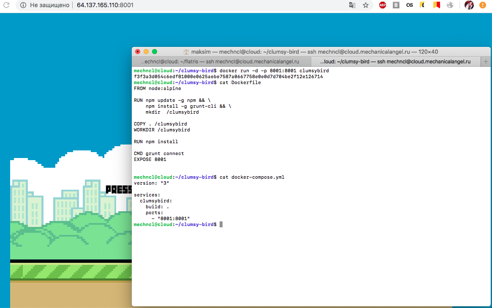

Домашнее задание №1 (со звездочкой)  для интенсива «Как перестать бояться и полюбить DevOps»

>Найдите на github / gitlab какое-нибудь другое приложение и проделайте эти же операции с ним. 
>Это может быть какая-нибудь простенькая игра, чатбот или что-то другое простое.

[Демо:](http://64.137.165.110:8001/) 

За основу для образа взят [Clumsy-bird](https://github.com/ellisonleao/clumsy-bird).

